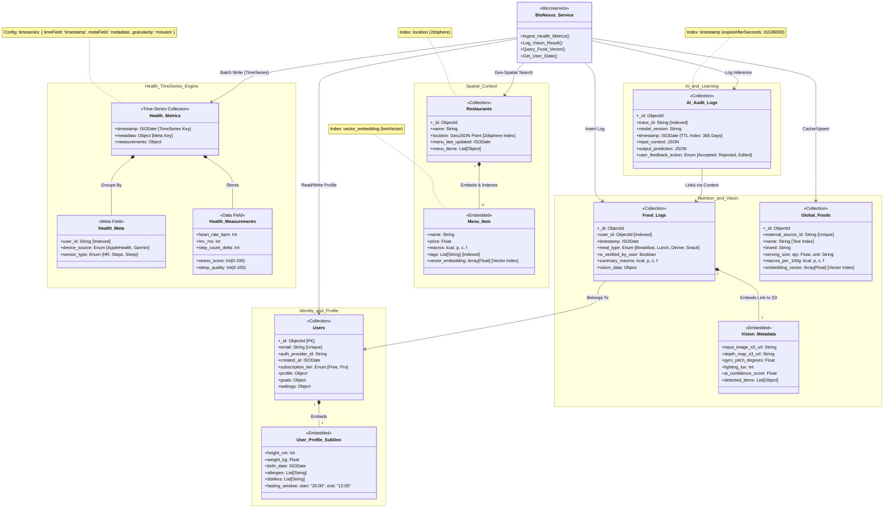

```mermaid
classDiagram
direction TB

    %% ==========================================
    %% 1. SYSTEM CONTEXT (THE GATEKEEPER)
    %% ==========================================
    class BioNexus_Service {
        <<Microservice>>
        +Ingest_Health_Metrics()
        +Log_Vision_Result()
        +Query_Food_Vector()
        +Get_User_State()
    }

    %% ==========================================
    %% 2. DATA STORAGE LAYER (MONGODB ATLAS)
    %% ==========================================

    namespace Identity_and_Profile {
        class Users {
            <<Collection>>
            +_id: ObjectId [PK]
            +email: String [Unique]
            +auth_provider_id: String
            +created_at: ISODate
            +subscription_tier: Enum [Free, Pro]
            +profile: Object
            +goals: Object
            +settings: Object
        }

        class User_Profile_SubDoc {
            <<Embedded>>
            +height_cm: Int
            +weight_kg: Float
            +birth_date: ISODate
            +allergies: List[String]
            +dislikes: List[String]
            +fasting_window: start: "20:00", end: "12:00"
        }
    }

    namespace Health_TimeSeries_Engine {
        class Health_Metrics {
            <<Time-Series Collection>>
            %% Clustered by time, granularity: 'minutes'
            +timestamp: ISODate [TimeSeries Key]
            +metadata: Object [Meta Key]
            +measurements: Object
        }

        class Health_Meta {
            <<Meta Field>>
            +user_id: String [Indexed]
            +device_source: Enum [AppleHealth, Garmin]
            +sensor_type: Enum [HR, Steps, Sleep]
        }

        class Health_Measurements {
            <<Data Field>>
            +heart_rate_bpm: Int
            +hrv_ms: Int
            +step_count_delta: Int
            +stress_score: Int (0-100)
            +sleep_quality: Int (0-100)
        }
    }

    namespace Nutrition_and_Vision {
        class Food_Logs {
            <<Collection>>
            %% The Master Record of "What I Ate"
            +_id: ObjectId
            +user_id: ObjectId [Indexed]
            +timestamp: ISODate
            +meal_type: Enum [Breakfast, Lunch, Dinner, Snack]
            +is_verified_by_user: Boolean
            +summary_macros: kcal, p, c, f
            +vision_data: Object
        }

        class Vision_Metadata {
            <<Embedded>>
            +input_image_s3_url: String
            +depth_map_s3_url: String
            +gyro_pitch_degrees: Float
            +lighting_lux: Int
            +ai_confidence_score: Float
            +detected_items: List[Object]
        }

        class Global_Foods {
            <<Collection>>
            %% Reference DB (FatSecret Cache + User Custom)
            +_id: ObjectId
            +external_source_id: String [Unique]
            +name: String [Text Index]
            +brand: String
            +serving_size: qty: Float, unit: String
            +macros_per_100g: kcal, p, c, f
            +embedding_vector: Array[Float] [Vector Index]
        }
    }

    namespace AI_and_Learning {
        class AI_Audit_Logs {
            <<Collection>>
            %% "Black Box" Recorder for RLHF
            +_id: ObjectId
            +trace_id: String [Indexed]
            +model_version: String
            +timestamp: ISODate [TTL Index: 365 Days]
            +input_context: JSON
            +output_prediction: JSON
            +user_feedback_action: Enum [Accepted, Rejected, Edited]
        }
    }

    namespace Spatial_Context {
        class Restaurants {
            <<Collection>>
            +_id: ObjectId
            +name: String
            +location: GeoJSON Point [2dsphere Index]
            +menu_last_updated: ISODate
            +menu_items: List[Object]
        }

        class Menu_Item {
            <<Embedded>>
            +name: String
            +price: Float
            +macros: kcal, p, c, f
            +tags: List[String] [Indexed]
            +vector_embedding: Array[Float] [Vector Index]
        }
    }

    %% ==========================================
    %% 3. RELATIONSHIPS & FLOW
    %% ==========================================

    BioNexus_Service --> Users : Read/Write Profile
    BioNexus_Service --> Health_Metrics : Batch Write (TimeSeries)
    BioNexus_Service --> Food_Logs : Insert Log
    BioNexus_Service --> Global_Foods : Cache/Upsert
    BioNexus_Service --> AI_Audit_Logs : Log Inference
    BioNexus_Service --> Restaurants : Geo-Spatial Search

    Users "1" *-- "1" User_Profile_SubDoc : Embeds
    Health_Metrics *-- Health_Meta : Groups By
    Health_Metrics *-- Health_Measurements : Stores
    Food_Logs "1" *-- "1" Vision_Metadata : Embeds Link to S3
    Food_Logs --> Users : Belongs To
    AI_Audit_Logs --> Food_Logs : Links via Context
    Restaurants "1" *-- "N" Menu_Item : Embeds & Indexes

    %% Note on Infrastructure
    note for Health_Metrics "Config: timeseries: { timeField: 'timestamp', metaField: 'metadata', granularity: 'minutes' }"
    note for Restaurants "Index: location (2dsphere)"
    note for Menu_Item "Index: vector_embedding (knnVector)"
    note for AI_Audit_Logs "Index: timestamp (expireAfterSeconds: 31536000)"

```
