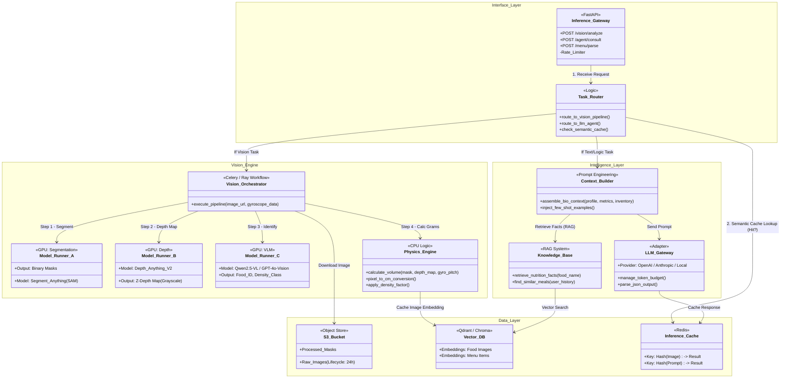

```mermaid
classDiagram
direction TB

    %% ==========================================
    %% 1. API & ROUTING LAYER
    %% ==========================================
    namespace Interface_Layer {
        class Inference_Gateway {
            <<FastAPI>>
            +POST /vision/analyze
            +POST /agent/consult
            +POST /menu/parse
            -Rate_Limiter
        }

        class Task_Router {
            <<Logic>>
            +route_to_vision_pipeline()
            +route_to_llm_agent()
            +check_semantic_cache()
        }
    }

    %% ==========================================
    %% 2. THE "DRAGUNOV" VISION PIPELINE (GPU)
    %% ==========================================
    namespace Vision_Engine {
        class Vision_Orchestrator {
            <<Celery / Ray Workflow>>
            +execute_pipeline(image_url, gyroscope_data)
        }

        class Model_Runner_A {
            <<GPU: Segmentation>>
            +Model: Segment_Anything (SAM)
            +Output: Binary Masks
        }

        class Model_Runner_B {
            <<GPU: Depth>>
            +Model: Depth_Anything_V2
            +Output: Z-Depth Map (Grayscale)
        }

        class Model_Runner_C {
            <<GPU: VLM>>
            +Model: Qwen2.5-VL / GPT-4o-Vision
            +Output: Food_ID, Density_Class
        }

        class Physics_Engine {
            <<CPU Logic>>
            +calculate_volume(mask, depth_map, gyro_pitch)
            +pixel_to_cm_conversion()
            +apply_density_factor()
        }
    }

    %% ==========================================
    %% 3. THE "BIO-ADAPTIVE" BRAIN (LLM)
    %% ==========================================
    namespace Intelligence_Layer {
        class Context_Builder {
            <<Prompt Engineering>>
            +assemble_bio_context(profile, metrics, inventory)
            +inject_few_shot_examples()
        }

        class LLM_Gateway {
            <<Adapter>>
            +Provider: OpenAI / Anthropic / Local
            +manage_token_budget()
            +parse_json_output()
        }

        class Knowledge_Base {
            <<RAG System>>
            +retrieve_nutrition_facts(food_name)
            +find_similar_meals(user_history)
        }
    }

    %% ==========================================
    %% 4. STORAGE & CACHING
    %% ==========================================
    namespace Data_Layer {
        class S3_Bucket {
            <<Object Store>>
            +Raw_Images (Lifecycle: 24h)
            +Processed_Masks
        }

        class Vector_DB {
            <<Qdrant / Chroma>>
            +Embeddings: Food Images
            +Embeddings: Menu Items
        }

        class Inference_Cache {
            <<Redis>>
            +Key: Hash(Image) -> Result
            +Key: Hash(Prompt) -> Result
        }
    }

    %% ==========================================
    %% 5. FLOWS & RELATIONS
    %% ==========================================

    %% Entry
    Inference_Gateway --> Task_Router : 1. Receive Request
    Task_Router --> Inference_Cache : 2. Semantic Cache Lookup (Hit?)
    Task_Router --> Vision_Orchestrator : If Vision Task
    Task_Router --> Context_Builder : If Text/Logic Task

    %% Vision Flow (The Heavy Lift)
    Vision_Orchestrator --> S3_Bucket : Download Image
    Vision_Orchestrator --> Model_Runner_A : Step 1 - Segment
    Vision_Orchestrator --> Model_Runner_B : Step 2 - Depth Map
    Vision_Orchestrator --> Model_Runner_C : Step 3 - Identify
    Vision_Orchestrator --> Physics_Engine : Step 4 - Calc Grams
    Physics_Engine --> Vector_DB : Cache Image Embedding

    %% Logic Flow (The Brain)
    Context_Builder --> Knowledge_Base : Retrieve Facts (RAG)
    Knowledge_Base --> Vector_DB : Vector Search
    Context_Builder --> LLM_Gateway : Send Prompt
    LLM_Gateway --> Inference_Cache : Cache Response
```
