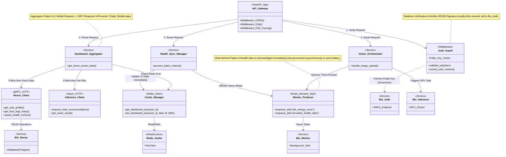

```mermaid
classDiagram
direction TB

    %% ==========================================
    %% 1. ENTRY POINTS & SECURITY
    %% ==========================================
    class API_Gateway {
            <<FastAPI_App>>
            +Middleware_CORS()
            +Middleware_GZip()
            +Middleware_OTel_Tracing()
        }

        class Auth_Guard {
            <<Middleware>>
            -Public_Key_Cache
            +validate_jwt(token)
            +extract_user_context()
        }

    %% ==========================================
    %% 2. AGGREGATION LOGIC (THE "GLUE")
    %% ==========================================
    class Dashboard_Aggregator {
            <<Service>>
            +get_home_screen_data()
            %% Fetches Profile + Food Logs + Health Metrics + Daily Plan
            %% Merges into single JSON response
        }

        class Vision_Orchestrator {
            <<Service>>
            +handle_image_upload()
            %% Uploads to S3 -> Triggers Inference -> Returns "Processing" status
        }

        class Health_Sync_Manager {
            <<Service>>
            +process_batch_metrics()
            %% Validates data -> Pushes to Worker Queue -> Updates Cache
        }

    %% ==========================================
    %% 3. INFRASTRUCTURE ADAPTERS (OUTBOUND)
    %% ==========================================
    class Nexus_Client {
            <<gRPC_HTTP>>
            +get_user_profile()
            +get_food_logs_today()
            +upsert_health_metrics()
        }

        class Inference_Client {
            <<Async_HTTP>>
            +request_meal_recommendation()
            +get_vision_result()
        }

        class Worker_Producer {
            <<Redis_Streams_SQS>>
            +enqueue_job("calc_energy_score")
            +enqueue_job("normalize_health_data")
        }

        class Cache_Manager {
            <<Redis_Client>>
            +get_dashboard_json(user_id)
            +set_dashboard_json(user_id, data, ttl: 300s)
        }

    %% ==========================================
    %% 4. EXTERNAL DEPENDENCIES (FROM MONOREPO)
    %% ==========================================
    class Bio_Auth {
        <<Service>>
        +JWKS_Endpoint
    }

    class Bio_Nexus {
        <<Service>>
        +Database (Postgres)
    }

    class Bio_Inference {
        <<Service>>
        +GPU_Cluster
    }

    class Bio_Worker {
        <<Service>>
        +Background_Jobs
    }

    class Redis_Cache {
        <<Infrastructure>>
        +Hot Data
    }

    %% ==========================================
    %% 5. DATA FLOW & RELATIONSHIPS
    %% ==========================================

    %% Entry
    API_Gateway --> Auth_Guard : 1. Verify Request
    Auth_Guard ..> Bio_Auth : Fetches Public Key (Once/Hour)
    API_Gateway --> Dashboard_Aggregator : 2. Route Request
    API_Gateway --> Vision_Orchestrator : 2. Route Request
    API_Gateway --> Health_Sync_Manager : 2. Route Request

    %% Aggregation Flows
    Dashboard_Aggregator --> Cache_Manager : Check Redis First
    Dashboard_Aggregator --> Nexus_Client : If Miss then Fetch Data
    Dashboard_Aggregator --> Inference_Client : If Miss then Get Plan

    %% Vision Flow
    Vision_Orchestrator --> Bio_Inference : Triggers GPU Task
    Vision_Orchestrator --> Worker_Producer : Queues "Post-Process"

    %% Write Flow (Optimization)
    Health_Sync_Manager --> Worker_Producer : Offload Heavy Writes
    Health_Sync_Manager --> Cache_Manager : Update UI State Immediately

    %% Infrastructure Connections
    Cache_Manager --> Redis_Cache : Read/Write
    Nexus_Client --> Bio_Nexus : CRUD Operations
    Worker_Producer --> Bio_Worker : Async Tasks

    %% Notes
    note for Dashboard_Aggregator "Aggregator Pattern:\n1 Mobile Request = 1 BFF Response.\nPrevents 'Chatty' Mobile Apps."
    note for Worker_Producer "Write-Behind Pattern:\nHealth data is acknowledged immediately,\nbut processed asynchronously to save battery."
    note for Auth_Guard "Stateless Verification:\nVerifies RS256 Signature locally.\nNo network call to Bio_Auth."
```
