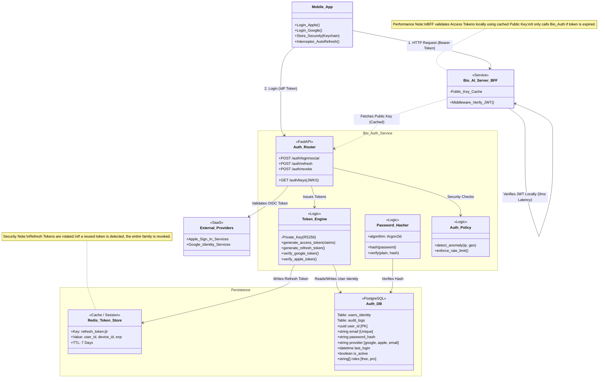

```mermaid
classDiagram
direction TB

    %% ==========================================
    %% 1. CLIENT LAYER
    %% ==========================================
    class Mobile_App {
        +Login_Apple()
        +Login_Google()
        +Store_Securely(Keychain)
        +Interceptor_AutoRefresh()
    }

    %% ==========================================
    %% 2. GATEWAY / BFF (The Consumer)
    %% ==========================================
    class Bio_AI_Server_BFF {
        <<Service>>
        +Middleware_Verify_JWT()
        -Public_Key_Cache
    }

    %% ==========================================
    %% 3. AUTH SERVICE (The Core)
    %% ==========================================
    namespace Bio_Auth_Service {
        class Auth_Router {
            <<FastAPI>>
            +POST /auth/login/social
            +POST /auth/refresh
            +POST /auth/revoke
            +GET /auth/keys (JWKS)
        }

        class Token_Engine {
            <<Logic>>
            -Private_Key (RS256)
            +generate_access_token(claims)
            +generate_refresh_token()
            +verify_google_token()
            +verify_apple_token()
        }

        class Password_Hasher {
            <<Logic>>
            +algorithm: Argon2id
            +hash(password)
            +verify(plain, hash)
        }

        class Auth_Policy {
            <<Logic>>
            +detect_anomaly(ip, geo)
            +enforce_rate_limit()
        }
    }

    %% ==========================================
    %% 4. STORAGE LAYER
    %% ==========================================
    namespace Persistence {
        class Redis_Token_Store {
            <<Cache / Session>>
            +Key: refresh_token:jti
            +Value: user_id, device_id, exp
            +TTL: 7 Days
        }

        class Auth_DB {
            <<PostgreSQL>>
            Table: users_identity
            Table: audit_logs
        }
    }

    %% ==========================================
    %% 5. EXTERNAL IDP
    %% ==========================================
    class External_Providers {
        <<SaaS>>
        +Apple_Sign_In_Services
        +Google_Identity_Services
    }

    %% ==========================================
    %% RELATIONSHIPS
    %% ==========================================

    %% Flow: Login
    Mobile_App --> Bio_AI_Server_BFF : 1. HTTP Request (Bearer Token)
    Mobile_App --> Auth_Router : 2. Login (IdP Token)

    %% Flow: Verification (The Performance Optimization)
    Bio_AI_Server_BFF ..> Auth_Router : Fetches Public Key (Cached)
    Bio_AI_Server_BFF --> Bio_AI_Server_BFF : Verifies JWT Locally (0ms Latency)

    %% Flow: Auth Logic
    Auth_Router --> External_Providers : Validates OIDC Token
    Auth_Router --> Token_Engine : Issues Tokens
    Auth_Router --> Auth_Policy : Security Checks

    %% Flow: Data
    Token_Engine --> Redis_Token_Store : Writes Refresh Token
    Token_Engine --> Auth_DB : Reads/Writes User Identity
    Password_Hasher --> Auth_DB : Verifies Hash

    %% Details
    class Auth_DB {
        +uuid user_id [PK]
        +string email [Unique]
        +string password_hash
        +string provider [google, apple, email]
        +datetime last_login
        +boolean is_active
        +string[] roles [free, pro]
    }

    note for Bio_AI_Server_BFF "Performance Note:\nBFF validates Access Tokens locally using cached Public Key.\nIt only calls Bio_Auth if token is expired."
    note for Redis_Token_Store "Security Note:\nRefresh Tokens are rotated.\nIf a reused token is detected, the entire family is revoked."
```
