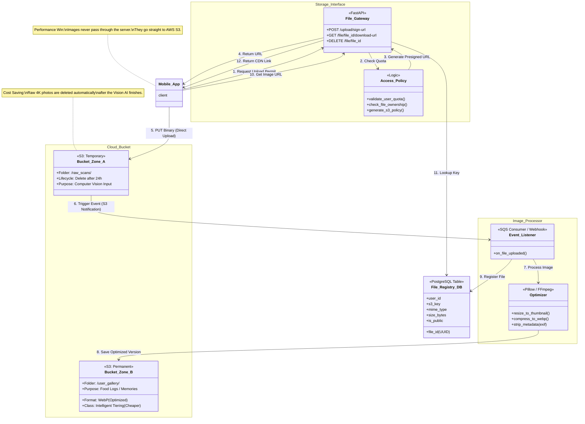

This is the full design and documentation for **`bio_storage`**.

In a production AI system, handling binary files (images) through your main API server is a bottleneck. It consumes RAM, blocks threads, and wastes bandwidth.

**`bio_storage`** is designed to solve this using the **Direct-to-Cloud (Presigned URL)** pattern.

---

### **System Design: `bio_storage`**



---

### **Detailed README: `bio_storage`**

Below is the documentation for the `bio_storage` service folder.

---

# **📦 Bio Storage Service**

**Asset Management & Blob Handling**

`bio_storage` is a stateless microservice responsible for managing User Generated Content (UGC), specifically food images. It abstracts the underlying Object Storage (AWS S3, Google Cloud Storage, or MinIO) and provides secure, temporary access credentials.

It enforces the **Direct-to-Cloud** pattern, ensuring our backend API servers never handle heavy binary upload streams.

---

## **1. Architectural Role**

1.  **The Gatekeeper:** Instead of users uploading files to us, we give them a specific, time-limited "key" (Presigned URL) to upload directly to the bucket.
2.  **The Librarian:** Maintains a database registry of every file, its owner, size, and location. If a file isn't in the registry, it's considered "garbage" and cleaned up.
3.  **The Optimizer:** Listens for new uploads and automatically creates thumbnails and highly compressed WebP versions for the UI, keeping the high-res version only if needed.

---

## **2. Tech Stack**

- **Framework:** [FastAPI](https://fastapi.tiangolo.com/)
- **Storage SDK:** `boto3` (Standard Python interface for AWS S3 & MinIO)
- **Image Processing:** `Pillow` (PIL) for resizing and conversion.
- **Database:** PostgreSQL (Specific `files` schema, distinct from Nexus health data).
- **Events:** `fastapi-events` or AWS SQS integration.

---

## **3. Folder Structure**

```bash
bio_storage/
├── app/
│   ├── api/
│   │   └── v1/
│   │       ├── upload.py      # Generates Presigned URLs
│   │       ├── download.py    # Generates CDN Links
│   │       └── webhooks.py    # S3 Event Listeners
│   ├── core/
│   │   ├── config.py          # AWS Credentials / MinIO Config
│   │   └── security.py        # Token validation
│   ├── services/
│   │   ├── s3_provider.py     # Wrapper around Boto3
│   │   └── image_optim.py     # Compression Logic
│   └── main.py
├── scripts/
│   └── init_buckets.py        # Creates buckets for local dev
├── tests/
├── Dockerfile
└── README.md
```

---

## **4. Key Workflows**

### **A. The "Presigned" Upload (Mobile -> S3)**

This is the only way to get a file into the system.

- **Endpoint:** `POST /api/v1/upload/sign`
- **Request:** `{ "filename": "steak.jpg", "content_type": "image/jpeg", "use_case": "vision_scan" }`
- **Logic:**
    1.  Validate file type (only allow images).
    2.  Determine bucket path (e.g., `temp/user_123/UUID.jpg`).
    3.  Call S3 `generate_presigned_url('put_object', ...)` with 60-second expiry.
    4.  Create a "Pending" entry in the DB.
- **Response:** `{ "upload_url": "https://s3.aws.com/...", "file_id": "UUID" }`
- **Mobile Action:** Uses standard `PUT` request to that URL.

### **B. Lifecycle Management (Cost Optimization)**

We implement two "Zones" of storage logic:

1.  **The Drop Zone (`bio-ai-raw`):**
    - Where images land initially.
    - **Lifecycle Policy:** Objects expire (delete) after 24 hours.
    - _Why:_ The Computer Vision engine needs the high-res 10MB photo to calculate volume. Once calculated, we don't need that massive file.

2.  **The Gallery Zone (`bio-ai-gallery`):**
    - Where images live permanently.
    - **Format:** Compressed WebP (Quality 80).
    - **Size:** Max 1080p.
    - _Why:_ This is what the user sees in their "Food Log" history. It costs 90% less to store than the raw file.

---

## **5. Environment Variables**

```ini
# App Config
PORT=8004
ENV="dev"

# Storage Provider (AWS or MinIO)
STORAGE_TYPE="minio" # or "aws"
AWS_ACCESS_KEY_ID="minioadmin"
AWS_SECRET_ACCESS_KEY="minioadmin"
AWS_REGION="us-east-1"
S3_ENDPOINT_URL="http://minio:9000" # Important for local docker

# Buckets
BUCKET_RAW="bio-ai-raw"
BUCKET_GALLERY="bio-ai-gallery"

# CDN (Optional)
CDN_DOMAIN="https://cdn.bioai.com"
```

---

## **6. Setup & Run**

### **Local Development (MinIO)**

We use MinIO to simulate AWS S3 locally so you don't pay cloud bills during development.

1.  **Start Infrastructure:**
    ```bash
    docker-compose up -d minio db
    ```
2.  **Initialize Buckets:**
    ```bash
    python scripts/init_buckets.py
    # Output: Created bucket 'bio-ai-raw', Created bucket 'bio-ai-gallery'
    ```
3.  **Run Service:**
    ```bash
    poetry install
    uvicorn app.main:app --port 8004
    ```

### **Testing the Flow (cURL)**

```bash
# 1. Get a URL
curl -X POST http://localhost:8004/api/v1/upload/sign \
     -H "Content-Type: application/json" \
     -d '{"filename": "test.jpg", "content_type": "image/jpeg"}'

# Response: {"upload_url": "http://minio:9000/..."}

# 2. Upload actual file
curl -X PUT -T ~/Desktop/test.jpg "http://minio:9000/..."
```

---

## **7. Integration with `bio_inference`**

When `bio_inference` runs the vision pipeline, it downloads the image from the **Raw Bucket**.
Once the inference is done and confirmed by the user, the `bio_storage` service moves/converts the image to the **Gallery Bucket** and lets the raw one expire.
