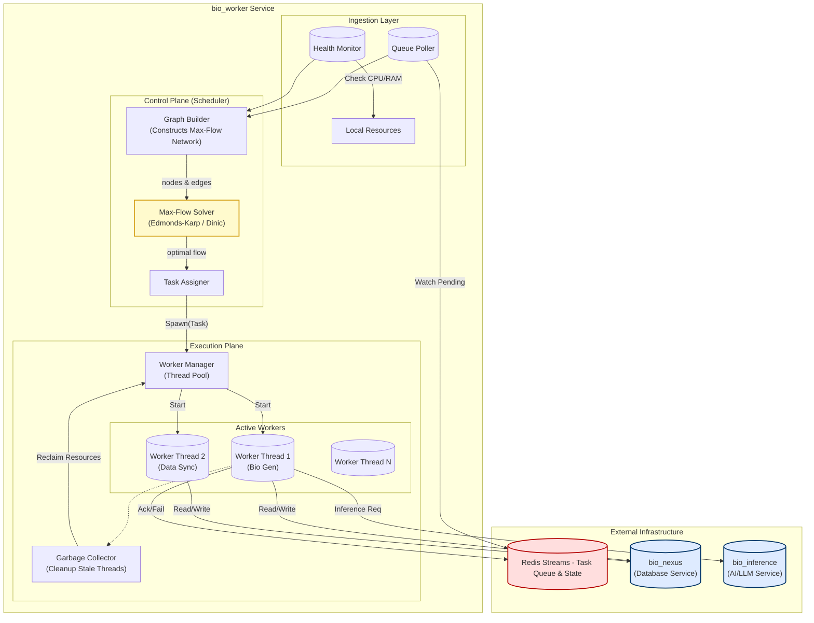

This design moves beyond simple queue consumption; it details the **Max-Flow Scheduling logic**, the separation of concerns between the **Control Plane** (Scheduler) and the **Execution Plane** (Workers), and the robust error handling required for an enterprise-grade AI system.

---

# **🛠️ Bio Worker Service: System Architecture**

## **1. Architectural Philosophy**

`bio_worker` is not merely a task consumer; it is an **intelligent resource orchestrator**.

In standard systems (like Celery), workers consume tasks FIFO (First-In, First-Out). However, in the Bio AI ecosystem, different tasks have vastly different resource footprints (e.g., a simple database write vs. a GPU-heavy LLM inference).

**`bio_worker` uses a Max-Flow Network algorithm** to dynamically map pending tasks to available system resources. This prevents "resource starvation" where small, fast tasks are blocked behind massive, slow AI generation tasks.

---

## **2. Detailed System Design**

The system is composed of three internal layers:

1.  **Ingestion Layer:** Monitors Redis Streams and local system health.
2.  **Orchestration Layer (The Brain):** Builds a flow graph to decide optimal task distribution.
3.  **Execution Layer (The Muscle):** Spawns threads/processes to interact with downstream services (`bio_nexus`, `bio_inference`).

### **System Architecture**

---

## **3. The Scheduling Algorithm (Max-Flow)**

This is the core differentiator of `bio_worker`. Instead of blindly popping tasks, the `scheduler.py` module constructs a **Directed Graph** every tick.

### **The Flow Network Concept**

To decide how many workers to spawn, the system builds a graph:

1.  **Source (S):** Represents the infinite potential of tasks.
2.  **Task Nodes (T):** One node per _type_ of task (e.g., `BioGen`, `DataSync`).
    - _Edge Capacity (S -> T):_ The number of pending tasks in Redis.
3.  **Agent Nodes (A):** One node per specific worker capability or priority level.
    - _Edge Capacity (T -> A):_ 1 (A task type maps to a capable agent).
4.  **Sink (D):** Represents the global concurrency limit (Max Threads).
    - _Edge Capacity (A -> D):_ The number of _free_ slots available for that agent type.

**The Algorithm:**
The Scheduler runs a Max-Flow algorithm (e.g., Dinic’s Algorithm) from **Source** to **Sink**. The result tells the system exactly how many tasks of each type to pick up to maximize throughput without exceeding limits.

---

## **4. Component Documentation**

### **A. `app/scheduler.py` (The Brain)**

Contains the logic for deciding _what_ runs.

- **`class GraphNode`**: Represents entities (Source, Task Types, Worker Slots).
- **`build_graph(pending_counts, available_slots)`**:
    - Queries Redis for how many tasks are waiting.
    - Checks `WorkerManager` for how many threads are currently free.
    - Constructs the network.
- **`calculate_max_flow()`**:
    - Solves the graph. Returns a "Flow Plan" (e.g., _"Start 3 Biography tasks and 1 Sync task"_).
- **`worker_generator()`**:
    - An async generator that yields tasks based on the Flow Plan.

### **B. `app/worker_manager.py` (The Muscle)**

Manages the lifecycle of Python threads/processes.

- **`workers` (Dict)**: A registry of active `Future` objects or `Threads` keyed by Task ID.
- **`start_worker(task_payload)`**:
    - Instantiates the correct Task Class (e.g., `BiographyTask`).
    - Wraps execution in a `try/except` block to catch crashes.
    - Spawns a thread via `asyncio.to_thread` or `concurrent.futures`.
- **`_worker_gc()` (Garbage Collection)**:
    - Runs every `CLEAN_WORKER_TIME` seconds.
    - Checks for "zombie" workers (threads that finished but weren't cleaned up).
    - Prunes the `workers` registry to free up slots for the Scheduler.

### **C. `app/tasks/` (The Business Logic)**

Contains the actual code that does the work.

- **`BaseTask`**: Abstract class enforcing `run()`, `on_success()`, and `on_failure()`.
- **`biography.py`**:
    1.  Fetches raw data from `bio_nexus`.
    2.  Formats prompt.
    3.  Calls `bio_inference` (LLM).
    4.  Parses JSON response.
    5.  Writes structured biography back to `bio_nexus`.

---

## **5. Internal State Machine (Task Lifecycle)**

A task moves through these specific states, tracked in Redis and the Worker:

1.  **`PENDING`**: Enqueued in Redis Stream.
2.  **`SCHEDULED`**: Picked by the Max-Flow algorithm, assigned to a pending slot.
3.  **`RUNNING`**: Thread spawned. Redis updated with "Heartbeat".
4.  **`COMPLETED`**: Logic finished successfully. Result saved to DB.
5.  **`FAILED`**: Exception raised.
    - _Retryable:_ Re-queued with backoff.
    - _Fatal:_ Moved to Dead Letter Queue (DLQ).

---

## **6. Failure Handling & Resilience**

1.  **Worker Timeout:**
    - Every worker has a `hard_limit` (e.g., 240s).
    - If `bio_inference` hangs, the `worker_manager` kills the thread and marks the task as `FAILED`.
2.  **Redis Disconnection:**
    - If the connection to the queue is lost, the Scheduler enters a "Circuit Breaker" mode, pausing graph generation until connection is restored.
3.  **Graceful Shutdown:**
    - On `SIGTERM` (Docker stop), the `WorkerManager`:
        - Stops accepting new tasks from `worker_generator`.
        - Waits `shutdown_timeout` (e.g., 30s) for active threads to finish.
        - Force kills remaining threads to prevent zombie processes.

---

## **7. Configuration & Environment Variables**

| Variable           | Default                     | Description                                            |
| :----------------- | :-------------------------- | :----------------------------------------------------- |
| `MAX_CONCURRENCY`  | `10`                        | Total number of worker threads allowed.                |
| `POLL_INTERVAL`    | `1.0`                       | How often the Scheduler calculates Max-Flow (seconds). |
| `WORKER_TIMEOUT`   | `240`                       | Max seconds a task can run before forced kill.         |
| `REDIS_STREAM_KEY` | `bio_tasks`                 | The Redis key to consume from.                         |
| `NEXUS_URL`        | `http://bio_nexus:8000`     | Internal URL for database API.                         |
| `INFERENCE_URL`    | `http://bio_inference:8000` | Internal URL for LLM API.                              |

---

## **8. Example: Tracing a "Generate Bio" Task**

1.  **User** requests a bio for "User 123" via API.
2.  **API** pushes JSON `{"type": "bio_gen", "user_id": 123}` to Redis Stream.
3.  **`bio_worker` Scheduler** wakes up.
    - Sees 1 pending `bio_gen` task.
    - Sees 9/10 slots free.
    - Graph result: "Admit 1 `bio_gen`".
4.  **Worker Manager** receives instruction.
    - Spawns `Thread-4`.
5.  **Thread-4** starts `BiographyTask`.
    - GET `bio_nexus/users/123`.
    - POST `bio_inference/generate`.
    - (Wait 5 seconds for LLM).
    - PUT `bio_nexus/users/123/bio`.
6.  **Thread-4** exits.
7.  **Garbage Collector** sees Thread-4 is dead, releases slot 10 back to pool.
8.  **Redis** entry is acknowledged (deleted).
