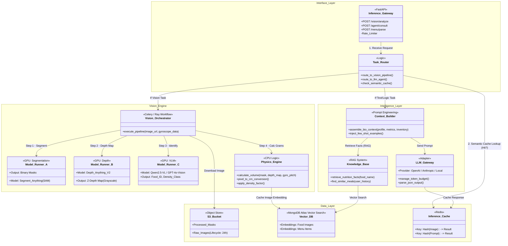

This is the official documentation for the **`bio_inference`** directory.
This README explains the **Architecture**, **Pipelines**, and **Deployment** of the AI/ML service.

---

# **🧠 Bio Inference Service**

**The Cognitive Engine & Vision Pipeline**

`bio_inference` is the heavy-lifting microservice responsible for **Computer Vision (CV)** and **Large Language Model (LLM)** operations. It is designed to be stateless, asynchronous, and scalable on GPU infrastructure.

It acts as a "Worker" that accepts complex tasks (images, bio-contexts) and returns structured JSON insights.

---

In our Monorepo, this service functions as the **Intelligence Layer**:

1.  **The "Dragunov" Vision System:** A custom multi-stage pipeline that converts 2D food photos into 3D volumetric calorie estimates using Depth Maps and Segmentation.
2.  **The Bio-Adaptive Brain:** A RAG (Retrieval-Augmented Generation) engine that generates personalized meal plans based on biological inputs (HRV, Sleep) rather than generic diet rules.
3.  **Vector Memory:** Uses **MongoDB Atlas Vector Search** (native vector indexes) to cache semantic states and food nutrition embeddings, reducing hallucination and API costs. Qdrant is no longer the default unless a specific ANN feature is required.

**Accuracy & Model Notes:**

- **Depth maps:** Volume estimation uses depth maps (from device sensors or model-inferred depth) combined with segmentation to compute food volumes for more accurate calorie estimation.
- **LLM generation:** Early natural language generation uses **GPT Nano** (small footprint LLM) for sentence generation and will be migrated to a dedicated in-house LLM as model training progresses.
- **GPU Execution:** Inference workloads run on serverless GPU providers (e.g., **Runpod**, CoreWeave) to enable scalable, on-demand GPU execution.

---

## **1. Architectural Role**



---

## **2. Tech Stack**

- **Framework:** [FastAPI](https://fastapi.tiangolo.com/) (Gateway) + [Celery](https://docs.celeryq.dev/) (Task Queue)
- **Deep Learning:** PyTorch, HuggingFace Transformers
- **Vision Models:**
    - **Segmentation:** `MobileSAM` (Segment Anything Model - Lightweight)
    - **Depth:** `Depth Anything V2` (Metric Depth Estimation)
    - **VLM:** `Qwen2.5-VL` or `GPT-4o-Vision` (via API)
- **LLM Orchestration:** LangChain / LlamaIndex
- **Vector DB:** MongoDB Atlas Vector Search (managed / local Mongo for dev).
- **Storage:** AWS S3 (via `boto3`) for temporary image processing.

---

## **3. Folder Structure**

```bash
bio_inference/
├── app/
│   ├── api/                   # HTTP Endpoints (Triggers)
│   ├── core/                  # Config & Logging
│   ├── pipelines/             # THE CORE LOGIC
│   │   ├── vision/
│   │   │   ├── dragunov.py    # Main Volume Estimation Logic
│   │   │   ├── sam_handler.py # Masking Logic
│   │   │   └── depth_handler.py
│   │   └── llm/
│   │       ├── agent.py       # Bio-Nutritionist Agent
│   │       ├── prompts.py     # System Prompts
│   │       └── rag.py         # Vector Search Logic
│   ├── services/
│   │   ├── physics_engine.py  # Pixel-to-Mass Math
│   │   └── s3_service.py
│   └── main.py
├── models/                    # Local Model Weights (GitIgnored)
│   ├── sam_mobile.pt
│   └── depth_anything_v2.pth
├── tests/
├── Dockerfile.gpu             # CUDA-enabled Dockerfile
├── pyproject.toml
└── README.md
```

---

## **4. Core Pipelines**

### **A. The "Dragunov" Vision Pipeline (Food Logging)**

**Goal:** Estimate calories without user input.

1.  **Input:** Image URL + Gyroscope Pitch (e.g., 45°).
2.  **Step 1: Segmentation (SAM):**
    - _Action:_ Generates a binary mask to separate the food (foreground) from the table (background).
    - _Why:_ We only want to measure the volume of the food, not the plate.
3.  **Step 2: Depth Mapping (Depth Anything):**
    - _Action:_ Generates a grayscale Z-map where pixel intensity = distance from camera.
4.  **Step 3: Physics Calculation:**
    - _Logic:_ Using the Gyro angle, we mathematically "flatten" the perspective. We calculate the volume of the "blobs" above the table plane.
5.  **Step 4: Density Lookup (VLM):**
    - _Action:_ AI identifies the food (e.g., "Steak") and retrieves its density (1.1 g/cm³).
6.  **Output:** `Mass (g) = Volume (cm³) * Density`.

### **B. The Bio-Adaptive Agent (Reasoning)**

**Goal:** Decide _what_ the user should eat.

1.  **Input:** User Context (Sleep: Poor, Stress: High, Inventory: [Eggs, Spinach]).
2.  **Retrieval (RAG):**
    - Search Vector DB for "High Stress Foods".
    - _Result:_ "Spinach (Magnesium), Dark Chocolate."
3.  **Synthesis (LLM):**
    - Combines Inventory + RAG Result + User Context.
    - _Decision:_ "Suggest Spinach Omelet. Magnesium helps stress, Eggs are in inventory."
4.  **Output:** JSON Card for UI.

---

## **5. Environment Variables**

Create a `.env` file (ensure this is `.gitignore`'d):

```ini
# Infrastructure
REDIS_URL="redis://redis:6379/0" # For Celery Queue
MONGODB_URI="mongodb://localhost:27017"  # Local Mongo for vector collections
S3_BUCKET_NAME="bio-ai-vision-temp"

# Model Weights (Paths or HuggingFace IDs)
MODEL_PATH_SAM="./models/mobile_sam.pt"
MODEL_ID_DEPTH="LiheYoung/depth-anything-small-hf"

# API Keys (For Fallbacks/VLM)
OPENAI_API_KEY="sk-..."
ANTHROPIC_API_KEY="sk-..."

# Compute Config
USE_CUDA="true" # Set false for local MacBook dev
```

---

## **6. Deployment & Setup**

### **Scenario A: Local Development (CPU)**

_Note: Vision pipelines will be slow (5-10s) on CPU._

```bash
# 1. Install Dependencies
poetry install --with cpu

# 2. Local Vector Search (MongoDB)
# Use a local MongoDB image and run `scripts/init_mongo_vectors.py` to create required collections and vector indexes.
docker run -p 27017:27017 --name mongo -d mongo:6.0
python scripts/init_mongo_vectors.py --host localhost --db bio_inference_vectors

# 3. Start Server
uvicorn app.main:app --port 8001
```

### **Scenario B: Production (GPU / RunPod)**

We prefer **serverless GPU providers** (Runpod, CoreWeave) for on-demand model execution, but also support containerized GPU instances for long-running jobs. Use a GPU-enabled Docker image (CUDA) when running on static GPU nodes.

```bash
# Build the GPU container
docker build -f Dockerfile.gpu -t bio_inference_gpu .

# Run with GPU access
docker run --gpus all -p 8001:8001 bio_inference_gpu
```

---

## **7. Performance Tuning**

1.  **Model Quantization:** We use `int8` quantization for the Vision Models. This reduces VRAM usage from 4GB to <1GB with minimal accuracy loss.
2.  **Warm-Up:** On server start, `main.py` performs a dummy inference. This loads model weights into GPU memory so the first user request isn't slow (Cold Start mitigation).
3.  **Batching:** If multiple images arrive simultaneously (e.g., bulk upload), `Celery` processes them in batches to maximize GPU throughput.
