This is the official documentation for the **`bio_ai_server`** directory.
This README explains the **Role**, **Architecture**, and **Setup** of the Backend-for-Frontend (BFF) service.

---

# **🧬 Bio AI Server (BFF)**

**The Orchestration Layer & Gateway**

`bio_ai_server` is a high-performance **Backend-for-Frontend (BFF)** service built with **FastAPI**. It serves as the single entry point for the Mobile App (`bio_ai`), abstracting the complexity of the underlying microservices (`bio_nexus`, `bio_inference`, `bio_auth`).

It does **not** own a database. Instead, it aggregates data, manages caching, and orchestrates asynchronous workflows.

---

In our Monorepo, this service acts as the **"Executive Function"**:

1.  **Aggregator Pattern:** Combines data from multiple sources (e.g., Profile from Nexus + Recommendations from Inference) into a single JSON response for the UI.
2.  **Stateless Security:** Validates JWTs locally using the `bio_auth` Public Key (RS256), protecting downstream services.
3.  **Write-Behind Proxy:** Accepts high-frequency HealthKit data immediately (returning `202 Accepted`) and offloads processing to `bio_worker` queues to save battery.
4.  **Resilience:** Implements Circuit Breakers. If the GPU Inference service is down, the BFF returns a fallback "Static Plan" so the app doesn't crash.

## **1. System Architecture**

```mermaid
classDiagram
direction TB

    %% ==========================================
    %% 1. ENTRY POINTS & SECURITY
    %% ==========================================
    class API_Gateway {
            <<FastAPI_App>>
            +Middleware_CORS()
            +Middleware_GZip()
            +Middleware_OTel_Tracing()
        }

        class Auth_Guard {
            <<Middleware>>
            -Public_Key_Cache
            +validate_jwt(token)
            +extract_user_context()
        }

    %% ==========================================
    %% 2. AGGREGATION LOGIC (THE "GLUE")
    %% ==========================================
    class Dashboard_Aggregator {
            <<Service>>
            +get_home_screen_data()
            %% Fetches Profile + Food Logs + Health Metrics + Daily Plan
            %% Merges into single JSON response
        }

        class Vision_Orchestrator {
            <<Service>>
            +handle_image_upload()
            %% Uploads to S3 -> Triggers Inference -> Returns "Processing" status
        }

        class Health_Sync_Manager {
            <<Service>>
            +process_batch_metrics()
            %% Validates data -> Pushes to Worker Queue -> Updates Cache
        }

    %% ==========================================
    %% 3. INFRASTRUCTURE ADAPTERS (OUTBOUND)
    %% ==========================================
    class Nexus_Client {
            <<gRPC_HTTP>>
            +get_user_profile()
            +get_food_logs_today()
            +upsert_health_metrics()
            +query_vector_search()      # New: query bio_storage / bio_nexus vector endpoints
            +request_archive_rehydrate()# New: trigger archival rehydrate
        }

        class Inference_Client {
            <<Async_HTTP>>
            +request_meal_recommendation()
            +get_vision_result()
        }

        class Worker_Producer {
            <<Redis_Streams_SQS>>
            +enqueue_job("calc_energy_score")
            +enqueue_job("normalize_health_data")
        }

        class Cache_Manager {
            <<Redis_Client>>
            +get_dashboard_json(user_id)
            +set_dashboard_json(user_id, data, ttl: 300s)
        }

    %% ==========================================
    %% 4. EXTERNAL DEPENDENCIES (FROM MONOREPO)
    %% ==========================================
    class Bio_Auth {
        <<Service>>
        +JWKS_Endpoint
    }

    class Bio_Nexus {
        <<Service>>
        +Database (MongoDB Atlas)
    }

    class Bio_Inference {
        <<Service>>
        +GPU_Cluster
    }

    class Bio_Worker {
        <<Service>>
        +Background_Jobs
    }

    class Redis_Cache {
        <<Infrastructure>>
        +Hot Data
    }

    %% ==========================================
    %% 5. DATA FLOW & RELATIONSHIPS
    %% ==========================================

    %% Entry
    API_Gateway --> Auth_Guard : 1. Verify Request
    Auth_Guard ..> Bio_Auth : Fetches Public Key (Once/Hour)
    API_Gateway --> Dashboard_Aggregator : 2. Route Request
    API_Gateway --> Vision_Orchestrator : 2. Route Request
    API_Gateway --> Health_Sync_Manager : 2. Route Request

    %% Aggregation Flows
    Dashboard_Aggregator --> Cache_Manager : Check Redis First
    Dashboard_Aggregator --> Nexus_Client : If Miss then Fetch Data
    Dashboard_Aggregator --> Inference_Client : If Miss then Get Plan

    %% Vision Flow
    Vision_Orchestrator --> Bio_Inference : Triggers GPU Task
    Vision_Orchestrator --> Worker_Producer : Queues "Post-Process"

    %% Write Flow (Optimization)
    Health_Sync_Manager --> Worker_Producer : Offload Heavy Writes
    Health_Sync_Manager --> Cache_Manager : Update UI State Immediately

    %% Infrastructure Connections
    Cache_Manager --> Redis_Cache : Read/Write
    Nexus_Client --> Bio_Nexus : CRUD Operations
    Worker_Producer --> Bio_Worker : Async Tasks

    %% Notes
    note for Dashboard_Aggregator "Aggregator Pattern:\n1 Mobile Request = 1 BFF Response.\nPrevents 'Chatty' Mobile Apps."
    note for Worker_Producer "Write-Behind Pattern:\nHealth data is acknowledged immediately,\nbut processed asynchronously to save battery."
    note for Auth_Guard "Stateless Verification:\nVerifies RS256 Signature locally.\nNo network call to Bio_Auth."
```



---

## **2. Tech Stack**

- **Framework:** [FastAPI](https://fastapi.tiangolo.com/) (Python 3.11+)
- **Async Runtime:** `uvloop` (Node.js-like performance)
- **Serialization:** `orjson` (Fastest JSON parsing available)
- **Caching:** Redis (via `redis-py`)
- **HTTP Client:** `httpx` (Async calls to microservices)
- **Observability:** OpenTelemetry (Traces) + Prometheus (Metrics)

---

## **3. Folder Structure**

```bash
bio_ai_server/
├── app/
│   ├── api/
│   │   ├── v1/
│   │   │   ├── endpoints/
│   │   │   │   ├── dashboard.py   # Aggregates Home Screen
│   │   │   │   ├── sync.py        # HealthKit Ingestion
│   │   │   │   └── vision.py      # Camera Upload Proxy
│   │   │   └── router.py
│   ├── core/
│   │   ├── config.py              # Pydantic Settings
│   │   ├── security.py            # JWT Validation Logic
│   │   └── exceptions.py          # Custom Error Handlers
│   ├── services/                  # BUSINES LOGIC LAYER
│   │   ├── aggregator.py          # Merges Profile + Food + AI
│   │   └── health_processor.py    # Validates sync payloads
│   ├── clients/                   # ADAPTER LAYER (Outbound)
│   │   ├── nexus_client.py        # HTTP/gRPC to Database Service
│   │   ├── inference_client.py    # HTTP to GPU Service
│   │   └── cache_manager.py       # Redis Wrapper
│   └── main.py                    # App Entrypoint
├── tests/
├── Dockerfile
├── pyproject.toml
└── README.md
```

---

## **4. Key Workflows & Logic**

### **A. The Dashboard Load (Read-Through Cache)**

- **Endpoint:** `GET /api/v1/dashboard`
- **Logic:**
    1.  Check Redis key `dashboard:{user_id}`. If exists → Return.
    2.  If miss:
        - Call `Nexus` (Profile, Food Logs).
        - Call `Inference` (Daily Recommendation).
        - _Wait for both (Parallel Execution)._
    3.  Construct `DashboardViewModel` JSON.
    4.  Save to Redis (TTL: 5 mins).
    5.  Return to Mobile.

### **B. The Health Sync (Write-Behind)**

- **Endpoint:** `POST /api/v1/sync/batch`
- **Logic:**
    1.  Validate JSON Schema (Pydantic).
    2.  Push payload to **Redis Streams** (topic: `ingest:health`).
    3.  Return `202 Accepted` immediately (Latency < 50ms).
    4.  _Note:_ The `bio_worker` service consumes the stream later to update the DB.

### **C. Vision Analysis (Circuit Breaker + Archive/Vector Integration)**

- **Endpoint:** `POST /api/v1/vision/upload`
- **Logic:**
    1.  Generate S3 Presigned URL for mobile upload via `bio_storage`.
    2.  Notify `Inference` service to expect a file.
    3.  On inference completion, `bio_inference` writes vision metadata; BFF persists food log to `bio_nexus`.
    4.  **Barcode Flow (FatSecret):** For barcode scans, the BFF calls the **FatSecret Platform API** to retrieve product and nutrition metadata. The returned data is shown to users and persisted to `bio_nexus` (Global_Foods) with `source: "fatsecret"` and `for_ml_training: true` so it can be consumed by model training pipelines.
    5.  BFF triggers `bio_storage` to compute embeddings and index them in MongoDB (async job).
    6.  **Circuit Breaker:** If `Inference` times out (>3s) or 500s:
        - Return "Queued for processing" status.
        - Do not fail the request.

---

## **5. Environment Variables**

Create a `.env` file in the root of this directory:

```ini
# Server Config
PROJECT_NAME="Bio AI BFF"
API_V1_STR="/api/v1"
ENV="dev" # dev, stage, prod

# Authentication (From bio_auth)
AUTH_PUBLIC_KEY_URL="http://bio_auth:8000/.well-known/jwks.json"

# Internal Microservices (Docker DNS)
NEXUS_SERVICE_URL="http://bio_nexus:8000"
INFERENCE_SERVICE_URL="http://bio_inference:8000"

# Infrastructure
REDIS_URL="redis://redis:6379/0"

# External APIs
OPENAI_API_KEY="sk-..." # Only if performing lightweight text parsing locally
```

---

## **6. Setup & Run**

### **Local Development**

We use **Poetry** for dependency management.

```bash
# 1. Install Dependencies
poetry install

# 2. Activate Shell
poetry shell

# 3. Run Server (Hot Reload)
uvicorn app.main:app --reload --port 8080
```

### **Docker Production**

```bash
docker build -t bio_ai_server .
docker run -p 8080:8080 --env-file .env bio_ai_server
```

---

## **7. Performance Optimization Tips**

- **GZip Middleware:** Enabled by default. Compresses large JSON payloads (Food Logs) by ~70%.
- **Connection Pooling:** `httpx.AsyncClient` is instantiated once in `main.py` and reused. Do not create a new client for every request.
- **JSON Serialization:** We use `ORJSONResponse`. Use it explicitly for heavy endpoints:
    ```python
    from fastapi.responses import ORJSONResponse
    @app.get("/items", response_class=ORJSONResponse)
    ```

---

## **8. API Documentation**

Once running, visit the interactive Swagger UI:

- **Local:** `http://localhost:8080/docs`
- **Redoc:** `http://localhost:8080/redoc`
