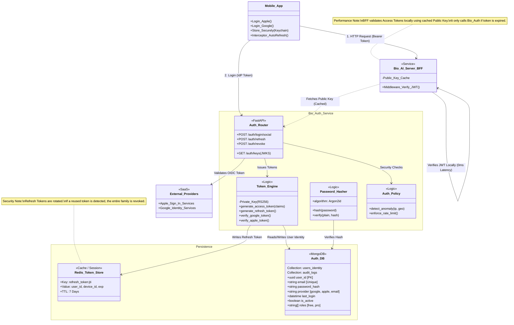

This document provides a comprehensive technical explanation of the **`bio_auth`** service. It details the architecture, the specific cryptographic choices, the data flow, and how it integrates with the rest of the **Bio AI** monorepo.

---

# **System Overview: `bio_auth`**

**`bio_auth`** is a standalone Identity Provider (IdP) microservice. Its sole responsibility is **Authentication** (Who are you?) and **Authorization** (What can you do?).

It is designed to be **write-heavy** on logins/refreshes but **read-light** for the rest of the system, preventing it from becoming a bottleneck during high-traffic events (like meal logging).

## **1. System Architecture**



## **2. Core Architectural Concepts**

### **A. Asymmetric Cryptography (RS256)**

Unlike simple apps that use a shared secret (HS256), `bio_auth` uses **RSA Signature with SHA-256 (RS256)**.

- **Private Key:** Held _only_ by `bio_auth`. Used to **sign** tokens.
- **Public Key:** Shared with `bio_ai_server` (BFF). Used to **verify** tokens.
- **Benefit:** The BFF can validate a user's identity mathematically without making an HTTP network request to the Auth service. This cuts latency from ~50ms to ~1ms per request.

### **B. Hybrid Token Strategy**

We use two types of tokens to balance security and usability:

| Token Type        | Lifespan       | Storage (Client)           | Purpose                                                          |
| :---------------- | :------------- | :------------------------- | :--------------------------------------------------------------- |
| **Access Token**  | Short (15 min) | Memory / Keychain          | Grants access to API resources. Contains Claims (User ID, Role). |
| **Refresh Token** | Long (7 Days)  | Secure Storage (Encrypted) | Used to get a new Access Token when the old one dies.            |

### **C. Token Rotation (Anti-Theft)**

If a Refresh Token is stolen, we implement **Rotation**:

1.  When a Refresh Token is used, it is deleted from Redis.
2.  A **new** Refresh Token is issued immediately.
3.  **Security Net:** If the _old_ (deleted) token is tried again, the system assumes theft and **revokes the entire family**, forcing the real user to log in again.

---

## **3. Component Deep Dive**

### **A. The API Layer (FastAPI)**

Exposes standard OIDC-style endpoints:

- `POST /login/google`: Validates the Google ID Token, checks if user exists in DB, returns pair of Bio AI tokens.
- `POST /login/apple`: Same logic for Apple Sign-In.
- `POST /refresh`: Takes a Refresh Token, validates against Redis, returns new pair.
- `POST /revoke`: Logs the user out (deletes key from Redis).
- `GET /.well-known/jwks.json`: Publishes the **Public Key** so other services can verify tokens.

### **B. The Storage Layer**

`bio_auth` uses two distinct storage engines:

1.  **MongoDB (`users_identity` collection)**
    - **Role:** The Source of Truth for identity metadata.
    - **Data:** `email`, `password_hash` (Argon2id), `provider_id` (Google/Apple sub), `roles` (free/pro).
    - **Isolation:** This DB is separate from `bio_nexus`. The health data (Nexus) refers to users only by `UUID`, ensuring that if the health DB is leaked, no emails/passwords are exposed.

2.  **Redis (The Allow-list)**
    - **Role:** High-speed state management for Refresh Tokens.
    - **Key:** `refresh:{jti}` (JWT ID).
    - **Value:** `user_id`, `device_info`.
    - **TTL:** Matches the Refresh Token lifespan (7 days). If Redis loses data, users just have to log in again (safe failure).

---

## **4. Detailed Data Flows**

### **Scenario 1: The "Zero Latency" API Call**

This is the most common action (e.g., User opens Dashboard).

1.  **Mobile App:** Sends `GET /dashboard` with Header `Authorization: Bearer <Access_Token>`.
2.  **BFF (`bio_ai_server`):**
    - Intercepts the request.
    - Checks its internal cache for the Auth Public Key.
    - Runs: `jwt.decode(token, public_key, algorithms=["RS256"])`.
3.  **Result:**
    - **Valid:** The Code continues to logic. **`bio_auth` is never touched.**
    - **Expired:** BFF returns `401 Unauthorized`.

### **Scenario 2: The Silent Refresh**

This happens automatically in the background when the user gets a `401`.

1.  **Mobile App:** Intercepts the `401`.
2.  **Mobile App:** Sends `POST /auth/refresh` to `bio_auth` with the **Refresh Token**.
3.  **`bio_auth` Service:**
    - Hashes the token and looks it up in **Redis**.
    - **Check:** Does it exist? Is it valid?
    - **Action:** Deletes the old token key from Redis.
    - **Action:** Mints a NEW Access Token + NEW Refresh Token.
    - **Action:** Saves new Refresh Token to Redis.
4.  **Mobile App:** Retries the original `GET /dashboard` request with the new Access Token.
5.  **User Experience:** Seamless. They never saw a login screen.

---

## **5. Security specifics**

### **Password Hashing**

- **Algorithm:** `Argon2id` (state-of-the-art).
- **Why:** It is memory-hard, making GPU brute-force attacks (used by hackers) extremely expensive and slow.

### **Role-Based Access Control (RBAC)**

- The **Access Token** contains a `roles` claim: `['pro', 'beta_tester']`.
- The BFF checks this claim directly:
    ```python
    if "pro" not in user.roles:
        raise PermissionDenied("Upgrade to Pro to use the AI Vision Scanner")
    ```
- This prevents database lookups to check subscription status on every request.

---

## **6. Integration with Monorepo**

- **`bio_nexus` Integration:**
    - When a new user registers in `bio_auth`, the service publishes an event (or makes a synchronous call) to `bio_nexus` to create an empty **Profile** (height, weight, etc.) using the same `UUID`.
- **`bio_ai_server` Integration:**
    - The BFF treats `bio_auth` as a trusted third party. It only needs the Public Key to function.

## **6. Summary of Benefits**

1.  **Performance:** The heavy traffic (Access Token validation) is distributed to the BFFs (horizontal scaling), not the Auth Service.
2.  **Security:** PII is isolated. Leaked Access Tokens expire in 15 minutes. Stolen Refresh Tokens are detected via Rotation.
3.  **Scalability:** Redis handles the write-heavy session management with sub-millisecond latency.
