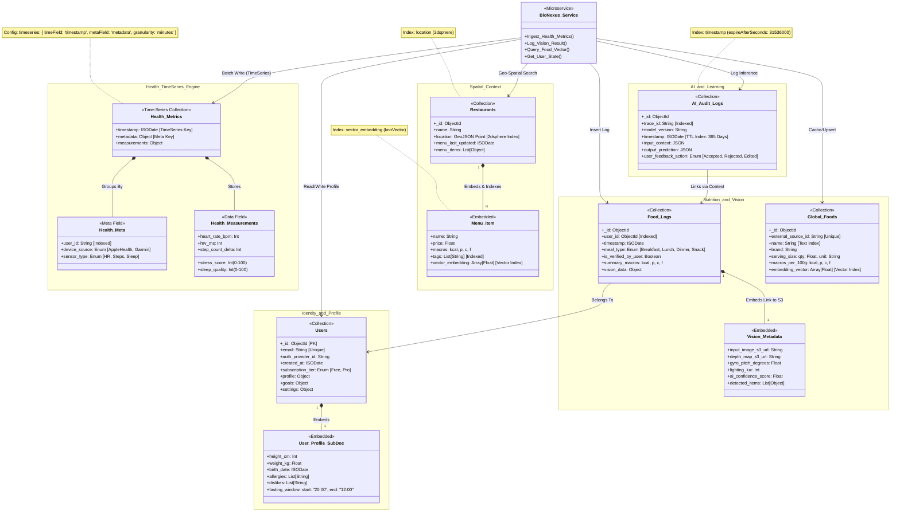

# BioNexus Service — README & Design 🗄️

**Role**

BioNexus is the authoritative storage and retrieval service for user-centric data: health metrics (time-series), food logs and vision metadata, canonical food references and embeddings, and AI audit logs. It provides a simple API for ingestion and query, offers vector similarity search for recommendation pipelines, and enforces indexing/retention policies to balance performance and cost.

**Architecture Summary**

- Backend: FastAPI (Python) microservice exposing ingest and query endpoints.
- Primary storage: MongoDB Atlas (Time-Series for metrics, Collections for logs and reference data).
- Secondary features: Vector indexes (for semantic/embedding similarity), TTLs for audit data, geospatial indexes for restaurants.

**Responsibilities**

- Ingest and persist high-frequency health metrics efficiently (time-series collection).
- Store vision output and links to media (S3), and provide a mapping from vision results → food logs.
- Maintain a canonical global food catalog with embeddings used by the recommendation pipeline.
- Provide observability/audit logs to trace model predictions and support RLHF workflows.

**Tech Stack**

- Framework: FastAPI (Python 3.11+)
- Database: MongoDB Atlas (Time-Series, Vector/knn indexes)
- Object storage: S3 (media & depth maps)
- Messaging (optional): Redis Streams or Kafka for background processing
- Observability: OpenTelemetry + Prometheus + Loki

**API Surface & Example Endpoints**

- POST /api/v1/metrics/batch — Ingest health metrics (time-series batch).
- POST /api/v1/vision/result — Store vision output and S3 pointers.
- POST /api/v1/food_logs — Create user food log (links to vision metadata if present).
- GET /api/v1/foods/search?query= — Text / embedding search over `Global_Foods`.
- GET /api/v1/users/{id} — Read user profile and metadata.

**Folder Structure (proposed)**

```
bio_nexus/
├── app/
│   ├── api/
│   │   ├── v1/
│   │   │   ├── endpoints/
│   │   │   │   ├── metrics.py
│   │   │   │   ├── vision.py
│   │   │   │   ├── foods.py
│   │   │   │   └── users.py
│   ├── core/
│   │   └── config.py
│   ├── db/
│   │   └── mongodb.py
│   └── services/
└── tests/
```

**Data Model Notes & Indexing Rationale**

- Health metrics: Use MongoDB Time-Series with `timestamp` as the timeField and `metadata` as the metaField for efficient time-range and multi-index queries (user_id + sensor_type).
- Global_Foods: add a text index on `name` and a vector index on `embedding_vector` to support combined text + semantic search.
- AI_Audit_Logs: TTL index (e.g., 365 days) to bound storage and keep recent audit trails available.

**Operational Runbook**

- Backups: Use Atlas scheduled snapshots and periodic exports of vector indexes.
- Index maintenance: Monitor index sizes; re-index during low-traffic windows.
- High write volumes: Horizontally scale shards and buffer writes via Redis Streams when needed.

**Environment Variables**

- MONGODB_URI (Atlas connection)
- S3_BUCKET_NAME
- REDIS_URL (if using streams)
- OAUTH_PUBLIC_KEY_URL (for any auth verification)

**Local Development & Run**

```bash
# 1. Create a venv and install
python -m venv .venv
.venv\Scripts\activate
pip install -r requirements.txt

# 2. Run the service
uvicorn app.main:app --reload --port 8000
```

**Monitoring & Alerts**

- Track ingest lag, time-series write failure rate, vector-index query latency, and TTL purge errors.
- Alert on: sustained increase in write latency, vector query 95th percentile latency > 200ms, sudden drop in incoming metrics.

## Diagram


