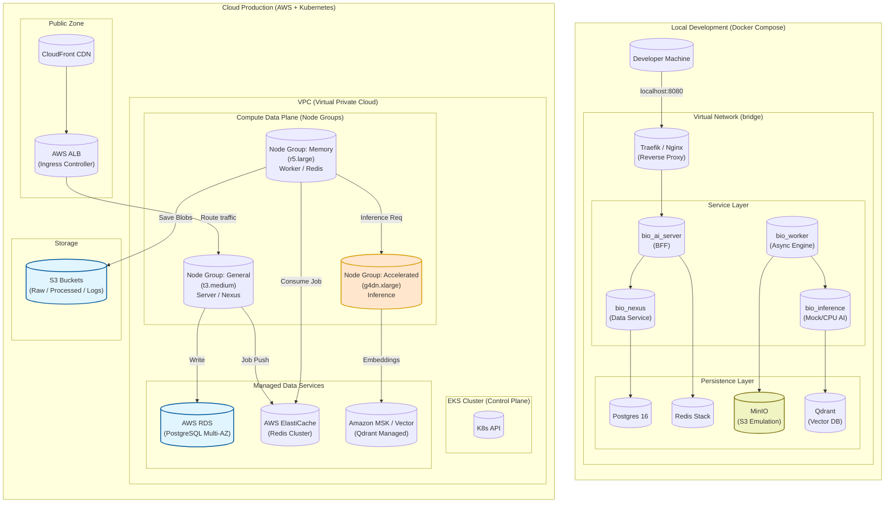

This is a comprehensive, deep-dive system design and documentation for the **`infra`** directory.

Unlike a simple repository of configuration files, this module represents the **Platform Engineering** layer of the Bio AI ecosystem. It enforces **Infrastructure as Code (IaC)** principles to ensure that the environment is reproducible, secure, and scalable from a developer's laptop to a production Kubernetes cluster.

---

# **🏗️ Infra Service: Platform Architecture**

## **1. Architectural Philosophy**

The `infra` directory is built on three core pillars:

1.  **Environment Parity:** The local Docker environment mirrors production architecture (using `MinIO` to mock `S3`, `Postgres` to mirror `RDS`).
2.  **Immutable Infrastructure:** Cloud resources are never modified manually. All changes are applied via Terraform/OpenTofu, ensuring the code is always the source of truth.
3.  **Segregated Workloads:** The infrastructure recognizes that AI workloads (Inference) have different hardware requirements than I/O workloads (API). The design uses specific Node Pools to optimize cost and performance.

---

## **2. Detailed System Design**

The architecture splits into two distinct lifecycles: **Local Development (Loop)** and **Cloud Production (Mesh)**.

### **System Architecture**



---

## **3. Component Documentation**

### **A. Local Environment (`docker-compose`)**

Designed for "one-command start" (`make up`).

- **Networking:** Uses a custom bridge network `bio_net`. Service discovery happens via DNS names (e.g., `ping bio_nexus`).
- **Volume Management:** All persistence is mapped to `.data/` on the host machine. This ensures developers don't lose database state when restarting containers.
- **S3 Emulation:** Uses `MinIO`. The application code uses `boto3` configured with `endpoint_url=http://minio:9000`. This allows the exact same code to run locally and on AWS S3.
- **Hot Reloading:** The Python services mount the local source code (`- ./../bio_ai_server:/app`) to enable live code updates without rebuilding images.

### **B. Cloud Infrastructure (Terraform)**

The Terraform configuration is modularized to support Multi-Environment deployment (Staging, Prod, DR).

#### **1. VPC Module (Networking)**

- Creates a VPC with **Public Subnets** (Load Balancers, NAT Gateway) and **Private Subnets** (Application Nodes, Databases).
- **Security Groups:** strictly enforce "Least Privilege". For example, the `bio_inference` security group only accepts port 8000 traffic from `bio_worker` or `bio_ai_server` security groups.

#### **2. EKS Module (Compute)**

This is the most critical component. It creates an Elastic Kubernetes Service cluster with **Heterogeneous Node Groups**:

- **`general-pool`**: Runs `bio_ai_server`, `bio_nexus`. Uses cost-effective instances (e.g., `t3.medium`).
- **`worker-pool`**: Runs `bio_worker`. Optimized for high memory if data processing is heavy.
- **`gpu-pool`**: Runs `bio_inference`. Tainted with `accelerator=nvidia` so that only pods requesting GPU resources are scheduled here. This prevents paying for GPU instances when running simple web servers.

#### **3. Data Module**

- **RDS (Postgres):** Provisions `db.t3.micro` (Staging) or `db.r5.large` Multi-AZ (Prod). Handles automated backups and encryption at rest.
- **ElastiCache (Redis):** Provisions a Redis Cluster for the Task Queue.

---

## **4. Folder Structure**

```bash
infra/
├── local/
│   ├── docker-compose.yml     # The main entry point for devs
│   ├── .env.example           # Template for environment variables
│   └── init-scripts/          # SQL or Shell scripts to seed local DBs
│       ├── 01_create_users.sql
│       └── 02_create_buckets.sh
├── terraform/
│   ├── main.tf                # Root module
│   ├── backend.tf             # S3 Backend config for state locking
│   ├── providers.tf           # AWS & Helm provider config
│   ├── modules/
│   │   ├── networking/        # VPC, Subnets, Route Tables
│   │   ├── compute/           # EKS, Node Groups, IAM Roles
│   │   ├── database/          # RDS, ElastiCache
│   │   └── storage/           # S3, ECR (Container Registry)
│   └── environments/
│       ├── staging/
│       │   └── terraform.tfvars
│       └── production/
│           └── terraform.tfvars
├── k8s/                       # Kubernetes Manifests (Helm Charts)
│   ├── bio-chart/             # Unified Helm Chart for the app
│   │   ├── templates/
│   │   └── values.yaml
│   └── argocd/                # GitOps configurations
└── scripts/
    ├── setup_local.sh         # Helper to install Docker/Make
    └── deploy_cloud.sh        # CI/CD helper script
```

---

## **5. Key Workflows**

### **A. Bootstrapping Local Dev**

To simulate a full production environment on a laptop:

```bash
# 1. Generate local certs and .env file
./scripts/setup_local.sh

# 2. Start Infrastructure
docker-compose -f local/docker-compose.yml up -d

# 3. Verify Health
# Checks http://localhost:8080/health
curl http://localhost:8080/api/v1/health
```

### **B. Provisioning Production (Terraform)**

```bash
cd infra/terraform

# 1. Initialize (Downloads providers and configures S3 backend)
terraform init

# 2. Workspace Selection
terraform workspace select production

# 3. Plan (Dry Run)
# Shows exactly what AWS resources will be created/modified
terraform plan -var-file="environments/production/terraform.tfvars"

# 4. Apply
terraform apply -var-file="environments/production/terraform.tfvars"
```

### **C. Deployment Strategy (GitOps)**

The infrastructure setups the cluster, but **ArgoCD** (running inside EKS) manages the application deployment.

1.  Terraform creates EKS + ECR.
2.  CI Pipeline builds Docker images -> Pushes to ECR.
3.  ArgoCD detects new image tag in the `k8s/` manifest repo.
4.  ArgoCD performs a **Rolling Update** to replace pods with zero downtime.

---

## **6. Configuration & Secrets**

### **Secrets Management**

- **Local:** Secrets are read from a `.env` file (git-ignored).
- **Production:** Secrets are **NOT** in Terraform code. They are stored in **AWS Secrets Manager**.
- **Injection:** The `ExternalSecrets` operator in Kubernetes reads from AWS Secrets Manager and injects them as Environment Variables into the pods at runtime.

### **Terraform State**

State is stored in an S3 Bucket with Versioning enabled. A DynamoDB table is used for **State Locking** to prevent two engineers from modifying infrastructure simultaneously.

---

## **7. Resilience & Scaling**

1.  **Horizontal Pod Autoscaling (HPA):**
    - If `bio_ai_server` CPU > 70%, K8s spins up more pods.
2.  **Cluster Autoscaling:**
    - If the `gpu-pool` is full and pending tasks exist, AWS Auto Scaling Group provisions a new EC2 instance automatically.
3.  **Disaster Recovery:**
    - RDS performs daily snapshots.
    - S3 buckets have cross-region replication (optional for compliance).
    - Terraform state allows rebuilding the entire network topology in a new region in <30 minutes.
